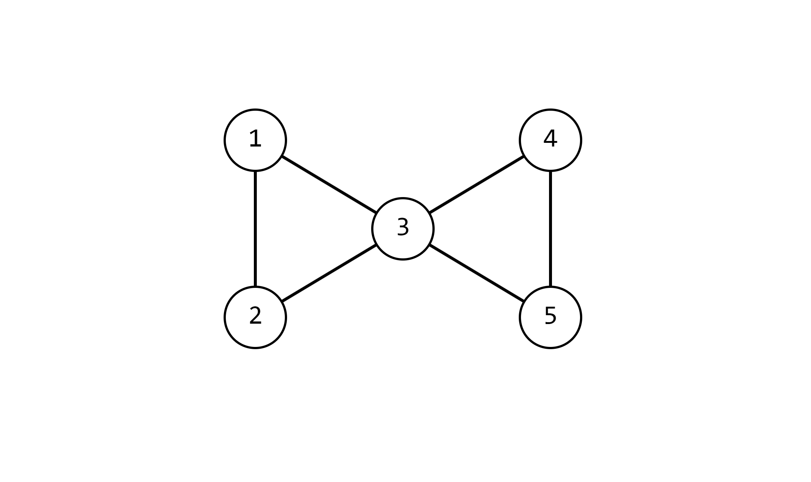
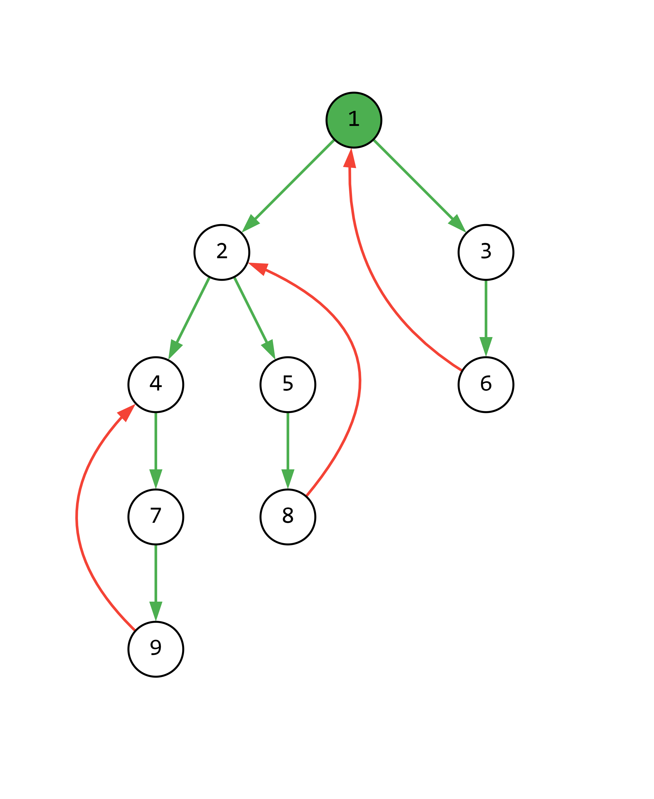

# Мосты и точки сочленения
- ***Мостом*** в неориентированном графе называется ребро, удаление которого увеличивает число компонент связности в графе.

- ***Точкой сочленения*** в неориентированном графе называется вершина, удаление которой, вместе с инцидентными ей рёбрами, увеличивает число компонент связности в графе.

Далее будем рассматривать неориентированные графы без петель и кратных рёбер, если не указано иное.

## Свойства мостов и точек сочленения
- **Утверждение №1:** Ребро в графе является мостом **тогда и только тогда, когда** в графе нет простого цикла, содержащего это ребро.

**Доказательство:** Пусть рассматриваем ребро <u, v>.

**$\rightarrow$:** Пусть ребро <u, v> — мост. Предположим противное, что существует простой цикл, содержащий это ребро. Тогда после удаления ребра <u, v> останется простой путь, соединяющий вершины u и v, следовательно, число компонент связности не увеличится — противоречие.

**$\leftarrow$:** Пусть нет простого цикла, содержащего ребро <u, v>. Предположим противное, что ребро <u, v> не является мостом. Тогда после его удаления останется простой путь, соединяющий вершины u и v, который не проходит через это ребро. Однако тогда можно построить простой цикл, состоящий из этого пути и ребра <u, v>, что означает существование простого цикла, содержащего данное ребро — противоречие.

- **Утверждение №2:** Если вершина является точкой сочленения, то её степень $\geq$ 2.

**Доказательство:** Для того, чтобы число компонент связности увеличилось, необходимо, чтобы существовали хотя бы две вершины u и v, между которыми пропадёт путь при удалении вершины w. Так как удаление w влечёт удаление только инцидентных ей рёбер, то необходимо, чтобы u и v были соединены с w рёбрами, то есть $deg(w) \geq$ 2.

- **Утверждение №3:** Если <u, v> — мост и $deg(v) \geq$ 2, то вершина v — точка сочленения.

**Доказательство:** Так как $deg(v) \geq$ 2, существует вершина w, такая что <v, w> — ребро в графе. Поскольку <u, v> — мост, все пути из u в w проходят через это ребро. Следовательно, после удаления вершины v не будет существовать пути из u в w, и число компонент связности возрастёт.

**Замечание:** Обратное утверждение неверно.

**Доказательство:** Достаточно рассмотреть граф, показанный ниже, где вершина 3 является точкой сочленения, но она не инцидентна ни одному мосту.



## Алгоритм Тарьяна для поиска мостов

Будем рассматривать каждую компоненту связности отдельно.

Возьмём произвольную вершину из данной компоненты и построим DFS-дерево, выбрав её в качестве корня. Получим разбиение рёбер на прямые и обратные. Обратные рёбра не могут быть мостами, так как они лежат на циклах. Следовательно, будем искать мосты среди прямых рёбер. Пусть <u, v> — прямое ребро, причём u — предок вершины v. Для того, чтобы <u, v> было мостом, необходимо, чтобы из поддерева вершины v не существовало обратного ребра, которое ведёт к предку вершины u. В противном случае ребро будет частью цикла, содержащего <u, v>.

Например, ниже представлено DFS-дерево с корнем в вершине 1. Зелёные рёбра — прямые, красные — обратные.



Заведём следующие векторы:

```cpp
vector<pair<int, int>> bridges(0);
vector<int> deeps(N, -1); // N - число вершин в графе

vector<vector<int>> g; // Граф, заданный списками смежности
```

В векторе `bridges` будем хранить найденные мосты, а вектор `deeps` будем использовать сразу для двух целей: во-первых, как индикатор того, была ли вершина посещена u, и, во-вторых, как минимальную глубину вершины, которую можно достичь каким-либо обратным рёбром из поддерева вершины u.

Не будем явно строить DFS-дерево, а просто будем запускать DFS, в ходе которого будем искать мосты в соответствующей компоненте связности.

```cpp
void dfs(int curr_V, int last_V, int curr_deep = 0) {
    deeps[curr_V] = curr_deep; // Отметка вершины как посещённой
    for (int next_V : g[curr_V]) { // Рекурсивный обход
        if (deeps[next_V] != -1) continue;
        dfs(next_V, curr_V, curr_deep + 1);
    }

    // Обновляем минимально достижимую глубину по обратным рёбрам
    for (int next_V : g[curr_V]) {
        if (next_V == last_V) continue;
        deeps[curr_V] = min(deeps[curr_V], deeps[next_V]);
    }

    // Теперь в deeps[curr_V] хранится минимум из curr_deep и минимальной глубины среди всех обратных рёбер

    //...
```

После этой части DFS можно будет определять, является ли ребро мостом. Однако следует учесть особый случай, связанный с реализацией: вершина, из которой запускается DFS, имеет фиктивного предка, что будет приводить к появление неверного моста. Поэтому необходимо дополнительно проверять, что мостом является корректное ребро (в частности, фиктивной предком корня является сам корень, как можно будет увидеть ниже, поэтому проверка достаточно простая).

```cpp
    // deeps[curr_V] при входе в curr_V инициализируется как curr_deep, и, следовательно, deeps[curr_V] может только уменьшиться
    if (curr_deep == deeps[curr_V] && curr_V != last_V) {
      bridges.push_back({curr_V, last_V});
    }
}
```

Осталось только правильно запустить DFS. Так как в графе может быть несколько компонент связности, будем запускать DFS для каждой компоненты в следующем цикле:

```cpp
for (int start_V = 0; start_V < N; start_V++) {
    if (deeps[start_V] == -1) {
        dfs(start_V, start_V, deeps, bridges, g);
    }
}
```
